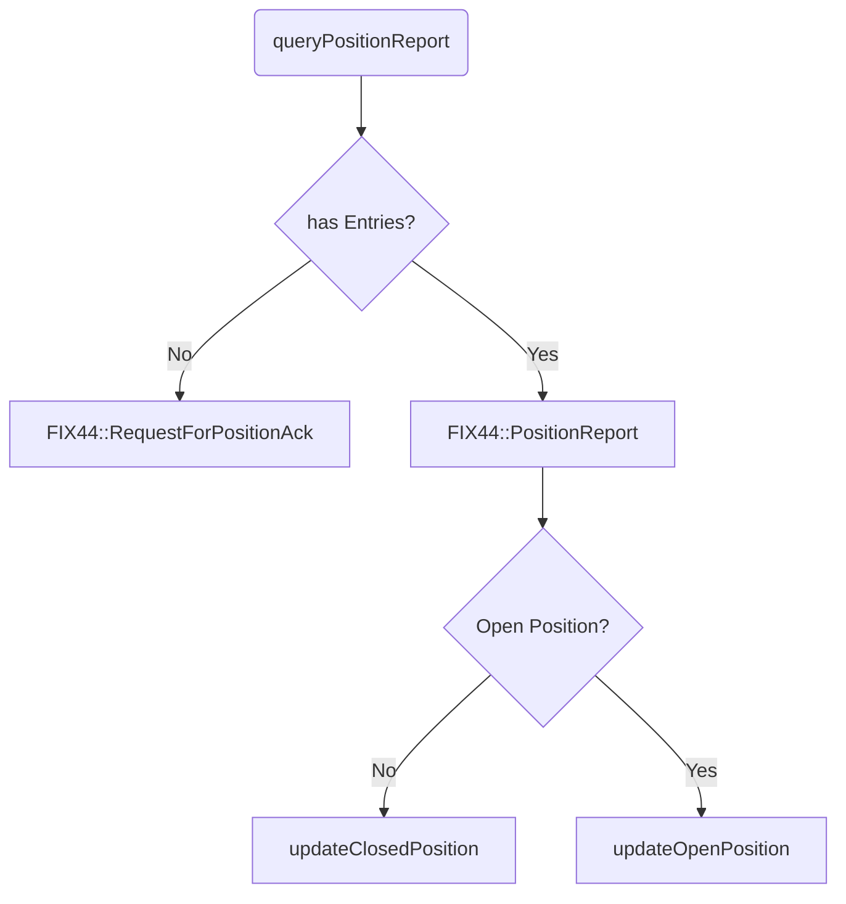

# FIX Message Flow

This document describes the message flow in a FIX application. Each query follows an answer, which is handled by an onMessage() function.


## PositionReport (queryPositions)

- query: FIX44::RequestForPositions

If there are no positions:

- onMessage: FIX44::RequestForPositionAck

If there are positions:

- onMessage: FIX44::PositionReport

```flow
st=>start: queryPositionReport()
cond_entries=>condition: has Entries?
op_positionReport=>operation: FIX44::PositionReport
op_positionAck=>operation: FIX44::RequestForPositionAck
cond_openclosed=>condition: Open Position?
op_updateOpen=>operation: updateOpenPosition(PosID)
op_updateClosed=>operation: updateClosedPosition(PosID)
e=>end

st->cond_entries
cond_entries(yes)->op_positionReport
cond_entries(no)->op_positionAck
op_positionReport->cond_openclosed
cond_openclosed(yes)->op_updateOpen
cond_openclosed(no)->op_updateClosed
```


## CollateralInquiry (queryAccounts)



