# IDEFIX Flow

This describes how IDEFIX is working.

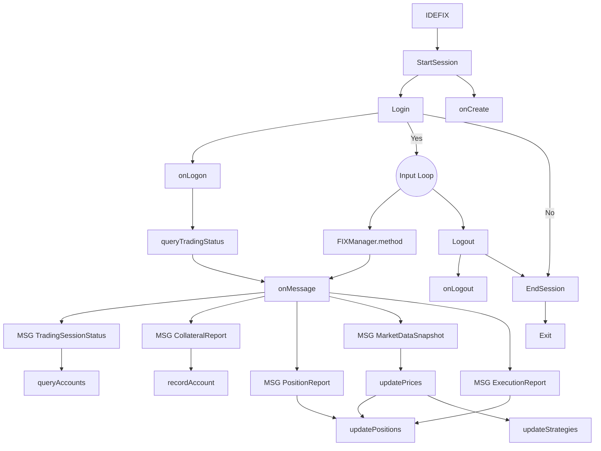

# FIX Message Flow in FIXManager

This section describes the message flow in a FIX application. Each query follows an answer, which is handled by an onMessage() function.

The document uses [mermaid](https://mermaidjs.github.io/flowchart.html) integration for flowchart image generation.

## queryPositionReport (PositionReport)

This method queries for open and closed positions.

- query: FIX44::RequestForPositions

If there are no positions:

- onMessage: FIX44::RequestForPositionAck

If there are positions:

- onMessage: FIX44::PositionReport

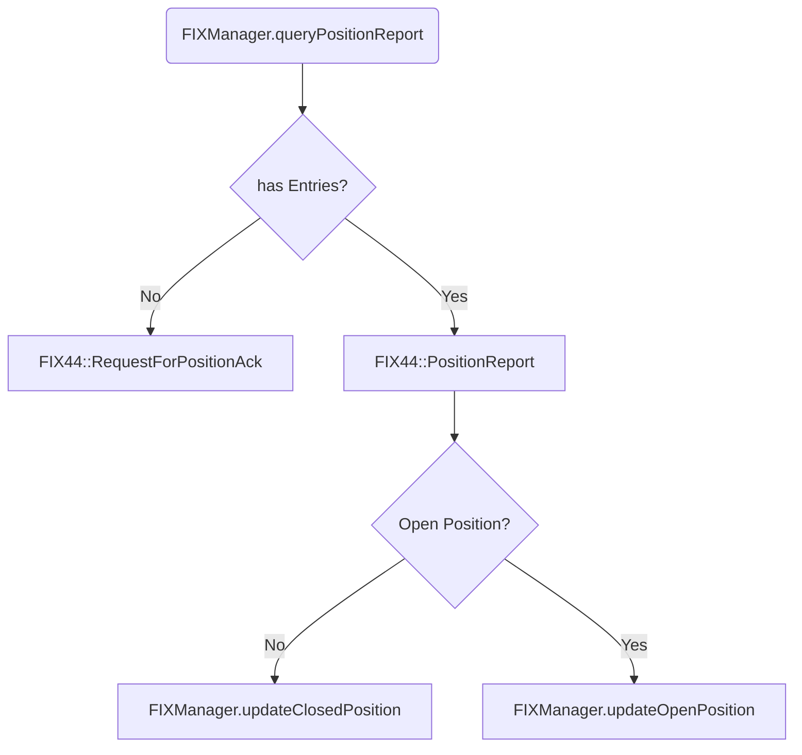

## queryAccounts (CollateralInquiry)

This method queries the available accounts and account settings.

- query: FIX44::CollateralInquiry
- onMessage: FIX44::CollateralInquiryAck
- onMessage: FIX44::CollateralReport

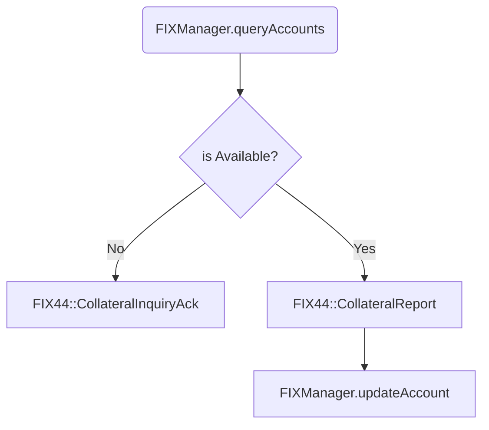

## subscribeMarketData (MarketDataRequest)

This method subscribes to price updates for a symbol.

- query: FIX44::MarketDataRequest
- onMessage: FIX44::MarketDataRequestReject
- onMessage: FIX44::MarketDataSnapshotFullRefresh

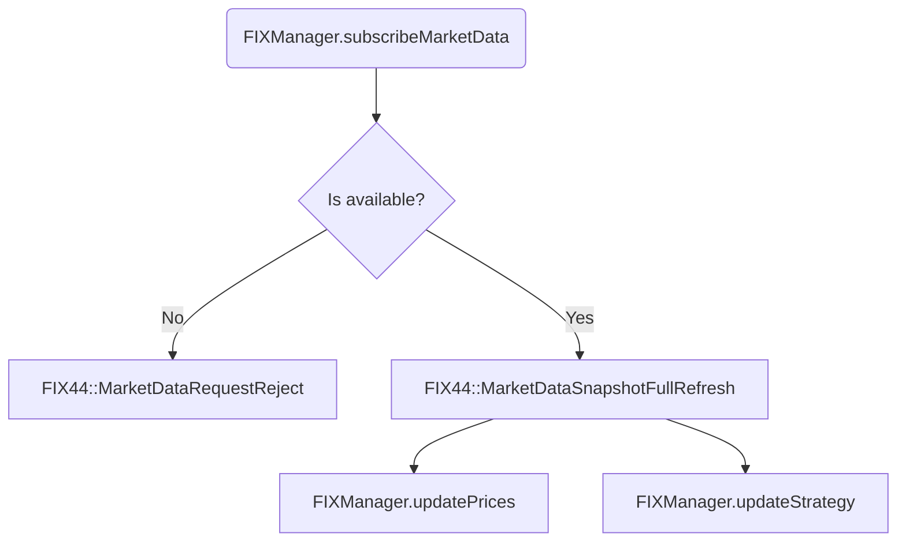

## unsubscribeMarketData (MarketDataRequest)

This method unsubscribes a symbol from market data.

- query: FIX44::MarketDataRequest

- onMessage: FIX44::MarketDataRequestReject

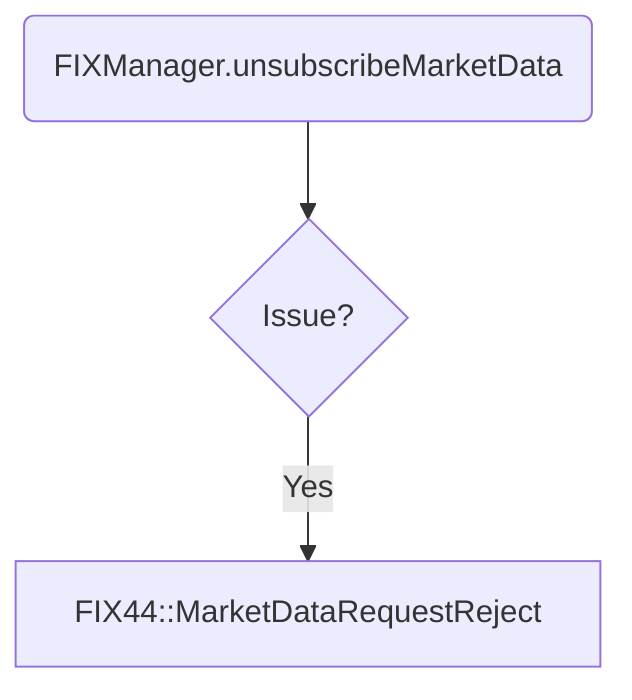

## queryClosePosition (NewOrderSingle)

This method queries the order session to close a position by FXCM_POS_ID.

- query: FIX44::NewOrderSingle
- onMessage: FIX44::ExecutionReport

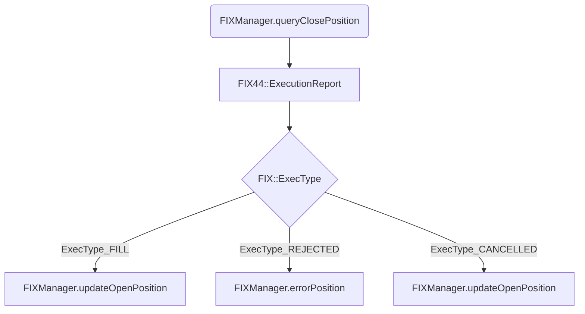

## marketOrder (NewOrderSingle)

This method queries the order session to open a new market order.

- query: FIX44::NewOrderSingle
- onMessage: FIX44::ExecutionReport

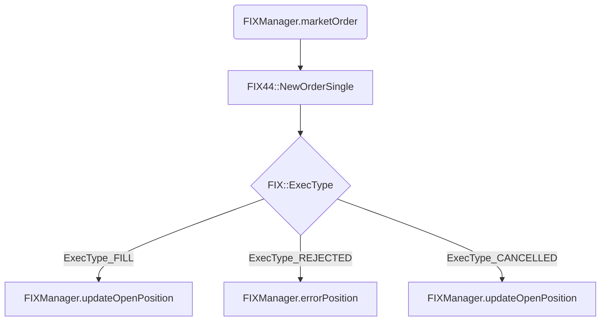

## stopOrder (NewOrderSingle)

This method queries the order session to close a market order by stop. Works only on non hedging accounts!!

- query: FIX44::NewOrderSingle
- onMessage: FIX44::ExecutionReport

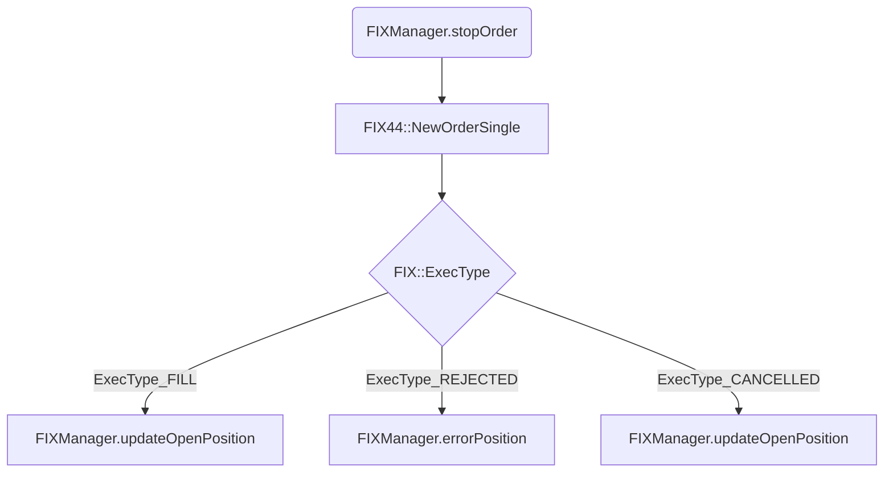

## marketOrderWithStopLoss

This method opens a new market order with stoploss order linked.

- query: FIX44::NewOrderList
- onMessage: FIX44::ExecutionReport

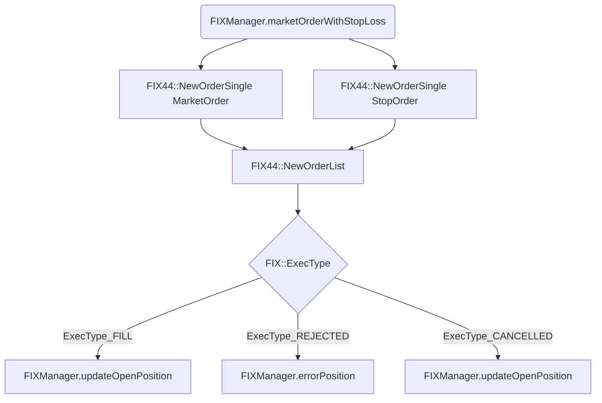

## marketOrderWithStopLossTakeProfit

This method opens a new market order with stoploss order and take profit order linked.

- query: FIX44::NewOrderList
- onMessage: FIX44::ExecutionReport

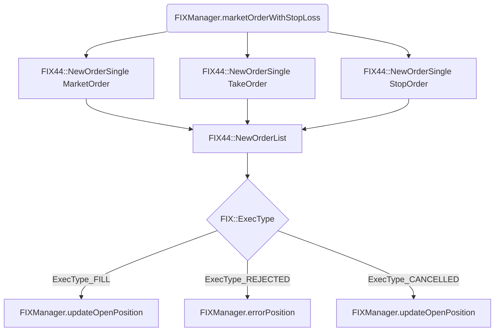

## queryTradingStatus (TradingSessionStatusRequest)

This method queries the trading session status. Additional information about the broker account can be retrieved here.

- query: FIX44::TradingSessionStatusRequest
- onMessage: FIX44::TradingSessionStatus

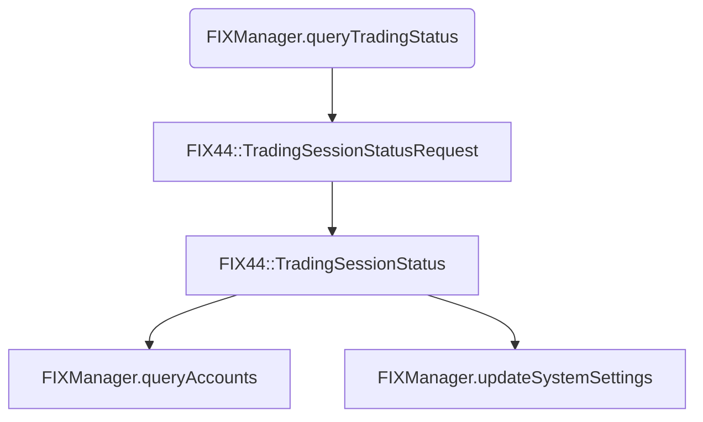

# FIXManager

## marketSnapshot

This method returns the latest market snapshot.

## closeAllPositions

For each open position sends this method a FIX44::NewOrderSingle Message via queryClosePosition().

## nextRequestID

Returns the next request ID for ClOrdID.

## nextOrderID

Returns the next order ID for ClOrdID.

## recordAccount

Add accountID to the account list.

## getSessionSettingsPtr

Returns the session settings pointer.

## isMarketDataSession

Returns true if this is a market data session.

## isOrderSession

Returns true if this is an order data session.

## updatePrices

Updates bid, ask, spread values and adds latest market snapshot to list.

## getPosition

Returns the open or closed position from internal lists.

## startSession

Starts a new FIX Session.

## endSession

Terminates the current FIX Sessions. Deallocates memory.

## QuickFIX Methods

- onCreate
- onLogon
- onLogout
- toAdmin
- toApp
- fromAdmin
- fromApp